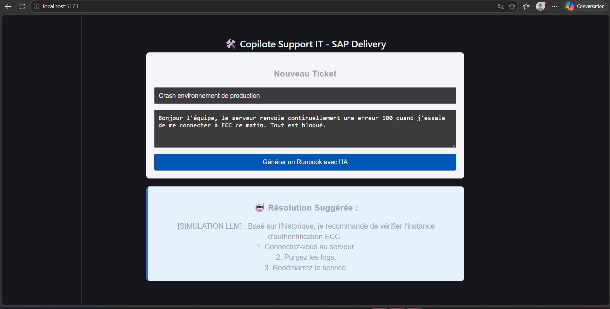

# Copilote Support IT (SAP) — retrouver comment un incident similaire a déjà été résolu

Ce projet sert à **aider un technicien du support informatique** : il décrit un incident, et l'outil retrouve les anciens incidents qui lui ressemblent, avec la solution qui avait été appliquée, pour préparer une procédure de résolution.

> **État du projet : preuve de concept (PoC).** La recherche des incidents similaires fonctionne, mais **la réponse affichée est pour l'instant un texte simulé, toujours le même** : aucune IA de rédaction n'est encore branchée. Les « anciens tickets » sont 4 exemples fictifs écrits dans le code.



---

## À quoi ça sert

Dans une entreprise, quand un logiciel tombe en panne, les employés ouvrent un **ticket** (une demande d'aide) auprès du support informatique. Ici, le logiciel concerné est **SAP**, un logiciel de gestion très répandu dans les grandes entreprises (comptabilité, achats, ressources humaines…).

Souvent, le même type de panne est déjà arrivé et a déjà été résolu. Mais retrouver le bon ancien ticket prend du temps, surtout si on ne connaît pas les mots exacts utilisés à l'époque.

Exemple : un employé écrit « la page charge dans le vide puis affiche un code 500 ». L'outil retrouve un ancien ticket « Impossible de se connecter à l'environnement de PROD, code erreur 500 », résolu par « Redémarrage de l'instance d'authentification et purge des logs ».

C'est comme un collègue expérimenté qui dirait : « Ça me rappelle un cas de l'an dernier, voilà ce qu'on avait fait. »

Le résultat visé est un **runbook** : une procédure de résolution écrite étape par étape.

---

## Comment ça marche

L'application est composée de trois programmes qui se parlent :

1. **L'interface** (dans le navigateur) : un formulaire avec le sujet et la description de l'incident.
2. **L'orchestrateur** : un programme intermédiaire qui reçoit la demande, la transmet au moteur de recherche, puis **enregistre** la question et la réponse dans un historique.
3. **Le moteur de recherche** : il retrouve les anciens tickets les plus proches et prépare le texte destiné à l'IA.

### Étape 1 — Préparer la base de connaissances (une seule fois)

1. Les anciens tickets (sujet, description, solution) sont **nettoyés** : passage en minuscules, suppression de la ponctuation.
2. Le sujet et la description de chaque ticket sont transformés en **embedding** : une liste de nombres qui représente le *sens* du texte. Deux textes qui parlent de la même chose obtiennent des listes de nombres proches, même s'ils n'utilisent pas les mêmes mots.
3. Ces embeddings sont rangés dans une **base vectorielle** : une base de données spécialisée qui sait retrouver rapidement les textes au sens le plus proche.

### Étape 2 — Traiter un nouvel incident

1. Le technicien saisit le sujet et la description dans l'interface.
2. Le moteur cherche les **2 anciens tickets les plus proches** dans la base vectorielle.
3. Il construit un **prompt** (le texte d'instructions destiné à une IA) qui contient : le rôle attendu (« assistant support SAP »), les 2 anciens tickets et leur solution, puis le nouveau problème.
4. Ce prompt est prévu pour être envoyé à un **LLM** (*Large Language Model*, « grand modèle de langage ») : un programme d'IA capable de rédiger du texte, comme celui derrière ChatGPT. **Cette étape est désactivée** : le code renvoie à la place un texte d'exemple fixe, marqué `[SIMULATION LLM]`.
5. L'orchestrateur enregistre le ticket et la réponse dans une petite base de données locale, puis renvoie la réponse à l'interface.

Cette méthode, qui consiste à **chercher** d'abord des informations utiles puis à les **donner** à l'IA pour qu'elle rédige sa réponse, s'appelle le **RAG** (*Retrieval-Augmented Generation*, « génération augmentée par la recherche »).

---

## Résultat / ce qu'on obtient

- Une page web avec un formulaire « Nouveau ticket » et un bouton **« Générer un Runbook avec l'IA »**.
- Une zone **« Résolution suggérée »** qui affiche la réponse. Aujourd'hui, c'est toujours le même texte simulé (voir la capture ci-dessus).
- Un **historique** des demandes enregistré dans une base de données locale (fichier `database.sqlite`).
- Côté moteur, la réponse technique contient aussi le **prompt complet** construit avec les anciens tickets retrouvés (champ `prompt_utilise`) : c'est là qu'on peut vérifier que la recherche a trouvé les bons tickets.

Pour obtenir de vraies réponses, il faudrait : remplacer les 4 tickets d'exemple par un véritable historique, et brancher un LLM (voir « Pour les développeurs »).

---

## Pour les développeurs

### Architecture

```
┌──────────────────────┐   POST /copilot/ask   ┌──────────────────────┐   POST /ask-copilot   ┌──────────────────────┐
│  1-frontend-react    │ ────────────────────► │  2-backend-nestjs    │ ────────────────────► │  ai-service-python   │
│  React + Vite        │ ◄──────────────────── │  NestJS + TypeORM    │ ◄──────────────────── │  FastAPI + ChromaDB  │
│  localhost:5173      │                       │  localhost:3000      │                       │  localhost:8000      │
└──────────────────────┘                       └──────────┬───────────┘                       └──────────────────────┘
                                                          │
                                                          ▼
                                               database.sqlite (SQLite)
                                               table tickets_historique
```

- **Frontend** (`1-frontend-react/src/App.jsx`) : formulaire sujet + description, appel `axios` à `http://localhost:3000/copilot/ask` (URL écrite en dur), affichage de `resolution_suggeree`.
- **Orchestrateur** (`2-backend-nestjs`) : route `POST /copilot/ask`, appel HTTP à `http://localhost:8000/ask-copilot` (URL écrite en dur), puis sauvegarde (`sujet`, `description`, `resolution_ia`, `date_creation`) dans la table `tickets_historique` de `database.sqlite` via TypeORM (`synchronize: true`). CORS ouvert à toutes les origines. Port configurable avec la variable `PORT` (3000 par défaut).
- **Moteur IA** (`ai-service-python`) :
  - `data_prep.py` : jeu de 4 tickets fictifs (`INC001` à `INC004`) défini dans le code, nettoyage du texte et création de la colonne `Contexte_Pour_Embedding` (`"sujet: ... | description: ..."`) ;
  - `build_vector_db.py` : indexation dans ChromaDB (collection `sap_tickets`, dossier `./chroma_db`) avec la fonction d'embedding par défaut de ChromaDB (modèle `all-MiniLM-L6-v2`, téléchargé au premier lancement) ; l'ID du ticket et la résolution sont stockés en métadonnées ;
  - `rag_pipeline.py` : recherche des 2 tickets les plus proches (`n_results=2`) et construction du prompt ;
  - `main.py` : API FastAPI, route `POST /ask-copilot`. L'appel à OpenAI (`gpt-3.5-turbo`) est présent mais **commenté** ; la réponse renvoyée est une chaîne simulée.

### Format de l'API Python

Requête `POST /ask-copilot` :

```json
{ "sujet": "Erreur 500 sur la prod SAP", "description": "Impossible d'accéder à SAP ECC ce matin." }
```

Réponse :

```json
{
  "status": "success",
  "sujet_analyse": "...",
  "resolution_suggeree": "[SIMULATION LLM] : ...",
  "prompt_utilise": "..."
}
```

Documentation interactive : http://localhost:8000/docs

### Stack technique

| Rôle | Outil |
|---|---|
| Interface | `React 19` + `Vite 8` + `axios` |
| Orchestrateur | `NestJS 11` + `@nestjs/axios` + `TypeORM` + `sqlite3` |
| Moteur IA | `FastAPI` + `Uvicorn` + `ChromaDB` + `pandas` |
| LLM (prévu, désactivé) | API OpenAI |
| Tests | `pytest` + `httpx` (Python), `jest` (NestJS) |

### Prérequis

- **Node.js** 20.19 ou plus récent (ou 22.12+) : exigence de Vite 8 ; NestJS 11 demande au minimum Node 20.
- **Python** 3.9 ou plus récent.
- Une connexion Internet au premier lancement (téléchargement du modèle d'embedding par ChromaDB).

### Installation

#### Moteur IA (Python)

```bash
cd ai-service-python
python -m venv venv
# Windows :
venv\Scripts\activate
# macOS / Linux :
source venv/bin/activate

pip install -r requirements.txt
pip install pandas openai   # absents de requirements.txt mais importés par le code
```

> `main.py` importe `openai` et `data_prep.py` importe `pandas` : sans ces deux paquets, le service ne démarre pas.

Générer la base vectorielle (une seule fois) :

```bash
python build_vector_db.py
```

Une base déjà construite est versionnée dans `ai-service-python/chroma_db/`. Cette étape est surtout nécessaire si vous modifiez les tickets de `data_prep.py`. Le service doit être lancé **depuis le dossier `ai-service-python`**, car le chemin `./chroma_db` est relatif.

#### Orchestrateur (NestJS)

```bash
cd 2-backend-nestjs
npm install
```

#### Interface (React)

```bash
cd 1-frontend-react
npm install
```

### Lancement (3 terminaux)

**Terminal 1 — Moteur IA**

```bash
cd ai-service-python
# activer l'environnement virtuel (ex. : venv\Scripts\activate)
python main.py
```

Service sur http://localhost:8000

**Terminal 2 — Orchestrateur**

```bash
cd 2-backend-nestjs
npm run start:dev
```

Service sur http://localhost:3000

**Terminal 3 — Interface**

```bash
cd 1-frontend-react
npm run dev
```

Interface sur http://localhost:5173 : ouvrez cette adresse dans votre navigateur.

### Brancher un vrai LLM

Dans `ai-service-python/main.py`, le bloc d'appel à OpenAI est commenté. Il utilise l'ancienne syntaxe `openai.ChatCompletion.create`, qui ne fonctionne qu'avec `openai<1.0` ; avec une version récente du paquet, il faut l'adapter (`OpenAI().chat.completions.create`). Fournissez la clé via une variable d'environnement plutôt que dans le code.

### Tests

Moteur IA (depuis `ai-service-python`, environnement virtuel activé, base vectorielle présente) :

```bash
pytest test/test_main.py -v -s
```

Deux tests : une requête valide renvoie `200`, une requête sans `description` renvoie `422`.

Orchestrateur : `npm test` (fichiers `*.spec.ts` générés par NestJS ; voir les points à corriger, ils ne déclarent pas les dépendances nécessaires).

### Structure du projet

```
copilote-support-ia/
├── 1-frontend-react/        # Interface React + Vite (src/App.jsx)
├── 2-backend-nestjs/        # Orchestrateur NestJS
│   ├── src/copilot/         # controller, service, module, ticket.entity
│   └── database.sqlite      # Historique des demandes (SQLite)
├── ai-service-python/
│   ├── data_prep.py         # Tickets d'exemple + nettoyage
│   ├── build_vector_db.py   # Création de la base vectorielle
│   ├── rag_pipeline.py      # Recherche + construction du prompt
│   ├── main.py              # API FastAPI
│   ├── chroma_db/           # Base vectorielle générée
│   ├── requirements.txt
│   └── test/test_main.py
├── chroma_db/               # Base ChromaDB vide (inutilisée par le code)
├── demo-interface.png
└── README.md
```

---

*Projet réalisé dans le cadre d'une preuve de concept d'industrialisation de l'IA pour les opérations SAP.*
